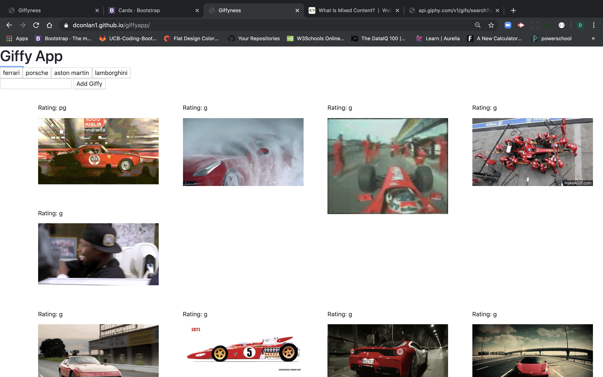

## giffyapp

 This is a quick game to play about cars. 

Click on the car to get some moving gifs.

Then you can click on the moving gifs to make them still.

Feel free to enter your own car and see what gifs come up.

# Built with: 
[link](http://info.cern.ch/hypertext/WWW/TheProject.html) HTML
[Link](https://www.w3.org/Style/CSS20/history.html) CSS
[Link](https://brendaneich.com/) Javascript 

## Getting Started

# here is the link to the game:  https://dconlan1.github.io/giffyapp/

# Prerequisites: one needs a web browser I should think, but aside from that, none. 

# Installing: This is a link and therefore there is nothing to install. Lucky you. 

# here are some screenshots of the game:

1. Ferrari

2. Lamborghini

3. Porsche
